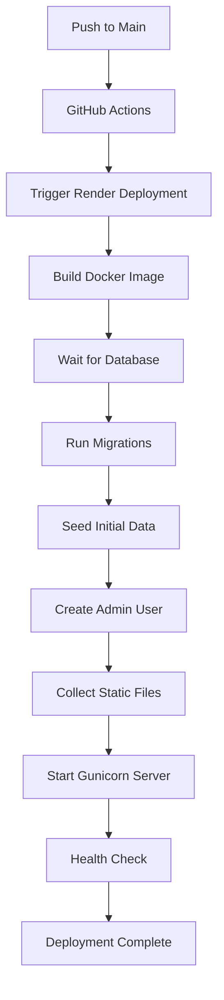

# Deployment Automation Configuration

## 🚀 **What Happens on Every Push to Main Branch:**

### **1. Automatic Database Migrations**
- ✅ Waits for database connection
- ✅ Runs `python manage.py migrate --noinput`
- ✅ Creates/updates all database tables

### **2. Initial Data Seeding**
- ✅ Creates user roles/groups (Admin, Professional, Patient)
- ✅ Sets up permissions for each role
- ✅ Seeds any required initial data

### **3. Admin User Creation**
- ✅ Creates admin superuser automatically
- ✅ Uses environment variables for credentials
- ✅ Skips if admin already exists

### **4. Static Files Collection**
- ✅ Collects all static files for production
- ✅ Optimizes for web serving

## 🔧 **Configuration Files Created:**

### **Deployment Script** (`backend/scripts/deploy.sh`)
- Orchestrates the entire deployment process
- Handles database setup, migrations, and server startup
- Includes error handling and logging

### **Django Management Commands:**

1. **`create_admin_user.py`**
   - Creates admin user with configurable credentials
   - Prevents duplicate admin creation
   - Uses environment variables for security

2. **`wait_for_db.py`**
   - Waits for database to be available
   - Prevents migration failures on startup
   - Configurable timeout

3. **`seed_initial_data.py`**
   - Creates user roles and permissions
   - Sets up initial application data
   - Idempotent (safe to run multiple times)

## 🔐 **Environment Variables (Render Dashboard):**

```bash
# Database (auto-configured by Render)
DATABASE_URL=postgresql://...

# Admin User Credentials
ADMIN_USERNAME=admin
ADMIN_EMAIL=admin@edumindsolutions.com
ADMIN_PASSWORD=[auto-generated by Render]

# Application Settings
SECRET_KEY=[auto-generated by Render]
DEBUG=False
ALLOWED_HOSTS=edumindsolutions.onrender.com
CORS_ALLOWED_ORIGINS=https://edu-mind-solutions.vercel.app
```

## 📋 **Default Admin User:**

- **Username**: `admin` (configurable via `ADMIN_USERNAME`)
- **Email**: `admin@edumindsolutions.com` (configurable via `ADMIN_EMAIL`)
- **Password**: Auto-generated by Render (check environment variables)
- **Role**: Superuser with all permissions

## 🎯 **User Roles Created:**

### **Admin**
- Full system access
- User management
- All CRUD operations

### **Professional**
- Healthcare provider access
- Assessment management
- Patient data access

### **Patient**
- Limited access
- Own profile management
- Assessment participation

## 🚀 **Deployment Flow:**



## 🔍 **Monitoring & Logs:**

### **Check Deployment Status:**
1. Go to Render Dashboard
2. Select your service
3. Check "Logs" tab for deployment progress

### **Expected Log Output:**
```
🚀 Starting deployment script...
⏳ Waiting for database connection...
✅ Database connection established!
📊 Running database migrations...
🌱 Seeding initial data...
✅ Created group: Admin
✅ Created group: Professional  
✅ Created group: Patient
👤 Creating admin user...
✅ Successfully created admin user: admin
📁 Collecting static files...
🚀 Starting Gunicorn server...
```

## 🛠️ **Troubleshooting:**

### **Common Issues:**

1. **Migration Failures**
   - Check database connection
   - Verify DATABASE_URL environment variable
   - Check migration files for conflicts

2. **Admin User Creation Fails**
   - Check if user already exists
   - Verify ADMIN_* environment variables
   - Check user model configuration

3. **Static Files Issues**
   - Verify STATIC_ROOT setting
   - Check file permissions
   - Ensure collectstatic runs without errors

### **Manual Commands (if needed):**

```bash
# Connect to Render shell
render shell

# Run specific commands
python manage.py migrate
python manage.py create_admin_user
python manage.py seed_initial_data
python manage.py collectstatic --noinput
```

## ✅ **Verification Steps:**

After deployment:

1. **Check API Health**: `https://edumindsolutions.onrender.com/health/`
2. **Test Admin Login**: Use admin credentials from environment variables
3. **Verify Database**: Check that tables and data exist
4. **Test Frontend**: Ensure frontend can connect to backend API

## 🔄 **Future Deployments:**

Every push to main branch will:
- ✅ Run migrations (safe, only applies new ones)
- ✅ Skip admin creation (if already exists)
- ✅ Update static files
- ✅ Restart server with zero downtime

**Your deployment is now fully automated!** 🎉
